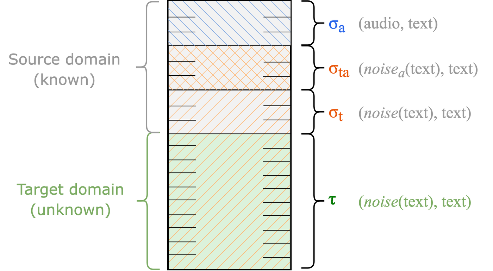

<!--
SPDX-FileCopyrightText: Copyright © 2025 Idiap Research Institute

SPDX-License-Identifier: MIT
-->

# Avoiding Catastrophic Forgetting in Text-Only Adaptation of LLM-based ASR via Multi-View Text Denoising

> **Quick Links:** [The idea](#-the-idea-speech-recognition-as-text-denoising) · [Reproducing the paper](#-reproducing-the-paper) · [Expected results](#-expected-results) · [Scripts](scripts/README.md) · [Installation](#-installation) · [Citation](#-citation)

This repo contains the code to reproduce our [Interspeech 2026 paper](https://www.isca-archive.org/interspeech_2026/burdisso26_interspeech.html) ([pdf](https://www.isca-archive.org/interspeech_2026/burdisso26_interspeech.pdf)).

> [!NOTE]
> Looking for the code of our follow-up paper, [*Closing the Speech-Text Gap with Limited Audio for Effective Domain Adaptation in LLM-based ASR*](https://www.isca-archive.org/interspeech_2026/banerasroux26_interspeech.html)?
> See the [README-speech-text-gap.md](README-speech-text-gap.md) file.

## 💡 The idea: Speech Recognition as Text Denoising

In **LLM-based ASR**, an speech encoder is wired to an LLM by one trainable module, the *projector* (also called a "connector" or "speech adapter"), which learns to map speech into the LLM's input embedding space.
The LLM reads those embeddings in place of tokens and writes out the transcript.

But what do those embeddings actually look like to the LLM?
They are continuous vectors, not tokens, so we asked which vocabulary entry each one lands closest to.
For the utterance *"yes that would be"*:

<pre>
<b>audio input</b>         🔊 "yes that would be"
      |                         |
      v                         v
<b>projector output</b>    📝 "mmy Z <b>Yes</b>ssS S SGS <b>that</b> Will B <b>be</b> S S"
                       <i>(each embedding mapped to its nearest LLM vocabulary entry)</i>
      |                         |
      v                         v
<b>LLM output</b>          📝 "yes that would be"
</pre>

It reads like a garbled version of what was said: the fragments in bold survive intact, while *"would"* comes through as *"Will B"*.

This suggests the LLM may be treating speech recognition as something closer to **cleaning up corrupted text**.
We take that as our working hypothesis and adapt on its terms: corrupt target-domain transcripts with a textual noise function, `noise(transcript)`, and train the LLM to recover them.
The new domain is learned from **text alone**, with no target-domain audio anywhere in the pipeline.

Training on that text by itself would eventually pull the LLM away from what the projector actually emits, collapsing the speech-text alignment it depends on: the catastrophic forgetting in the title.
Each batch therefore mixes four views of the data, three drawn from the **source domain** the base model already knows and one from the **target domain** being adapted to, so the LLM keeps denoising real projector output while it picks up the new domain.
The only audio involved is source-domain audio you already have.

<div align="center">
  
  <p><em>Batch composition used for fine-tuning the LLM during text-only adaptation to a target domain. Here, &sigma;<sub>a</sub>, &sigma;<sub>ta</sub> and &sigma;<sub>t</sub> denote the source-domain batch proportions, and &tau; denotes the target-domain proportion.</em></p>
</div>

Check out [our paper](https://www.isca-archive.org/interspeech_2026/burdisso26_interspeech.pdf) for all the details.
The code here does more than reproduce the tables: every parameter is exposed as an environment variable, so you can change any part of the setup and try your own.
Want to play with the batch proportions shown above, for instance?
Those knobs are listed in [`scripts/README.md`](scripts/README.md#text-only-adaptation).

### 🔊 What if you do have a little target-domain audio?

Text alone still leaves a gap to fine-tuning on real target audio.
Our [follow-up Interspeech 2026 paper](https://www.isca-archive.org/interspeech_2026/banerasroux26_interspeech.pdf) asks how much target audio it takes to close it.
The answer: surprisingly little.
Mixing just 10% of the target audio into these same batches matches or beats fine-tuning on all of it.
See [README-speech-text-gap.md](README-speech-text-gap.md) to reproduce it with this code.

## 🚀 Installation

Everything runs in one conda environment:

```bash
conda env create -f environment.yml
conda activate slam_llm
```

> [!TIP]
> For additional installation details or alternative setup methods, see the [original SLAM-LLM repository](https://github.com/X-LANCE/SLAM-LLM/).

## ▶️ Reproducing the paper

The [`scripts/`](scripts/README.md) folder holds one sub-folder per table in the paper:

| Table | Experiment | Folder |
|-------|-----------|--------|
| 2 | In-domain adaptation (DefinedAI) | [`scripts/table2/`](scripts/table2/) |
| 3 | Out-of-domain adaptation (SlideSpeech) | [`scripts/table3/`](scripts/table3/) |
| 4 | Cross-domain adaptation (DefinedAI → SlideSpeech) | [`scripts/table4/`](scripts/table4/) |
| 5 | Ablation of the source-side batch components | [`scripts/table5/`](scripts/table5/) |
| 6 | Ablation of the noise function | [`scripts/table6/`](scripts/table6/) |

The `*-fang-et-al` and `*-ma-et-al` folders alongside tables 2 to 4 reproduce the two baselines.

Every folder runs the same way.
Taking Table 3 and its agriculture target as an example, once the environment is ready a whole row is four steps:

```bash
# 1. point the scripts at your speech encoder and LLM
#    (edit the "Model and data paths" block)
$EDITOR scripts/common/config_defaults.sh

# 2. point the bundled SlideSpeech splits at your copy of the audio
bash scripts/prepare_slidespeech.sh /path/to/slidespeech/audio

# 3. run one target domain end to end
TARGET_DOMAIN=agriculture bash scripts/table3/run_all.sh

# 4. read the WER once the jobs finish
cat exp/table3/TOA/prompt_llama/agriculture_tau_0.47/epoch_5/WER.txt
```

Step 3 queues the whole pipeline (base training, base decoding, adaptation, final decoding) as SLURM jobs chained by dependency, and skips any stage whose output already exists.
The base model is therefore trained once per table and reused by every row, including the baselines.

Each folder has its own README with the exact commands for its rows, and [`scripts/README.md`](scripts/README.md) walks through the whole workflow and every option you can change.

### 📁 Data preparation

Training data is a JSONL file with one utterance per line:

```json
{"key": "agriculture_0001-00000", "source": "/path/to/agriculture_0001-00000.wav", "target": "AND THE LAST BUT NOT LEAST"}
```

During text-only adaptation only the `target` field of the target-domain file is read; its `source` paths are never opened, so they may point at audio you do not have.

**SlideSpeech.** The exact partitions used in the paper ship with this repository under [`data/slidespeech/`](data/slidespeech/).
**No audio is distributed**: those files contain only our domain splits, the original utterance identifiers, and the ground-truth transcripts after our preprocessing and normalisation, included to the minimal extent needed for reproducibility.
The transcript text remains subject to the original corpus license and terms of use.
Download the corpus from the [SlideSpeech project page](https://slidespeech.github.io/), then point the files at your copy of the audio:

```bash
bash scripts/prepare_slidespeech.sh /path/to/slidespeech/audio
```

See [`data/slidespeech/README.md`](data/slidespeech/README.md) for how the partitions were built, the expected audio layout, and the citation.

**DefinedAI.** A commercial corpus ([defined.ai](https://defined.ai)) that we cannot redistribute.
Prepare your own JSONL files in the format above and set the paths in `scripts/table{2,4,5,6}*/config.sh`.

### 🔊 Speech encoder and LLM

- Speech encoder: [WavLM-Large](https://github.com/microsoft/unilm/tree/master/wavlm)
- LLM: [Llama-3.2-3B-Instruct](https://huggingface.co/meta-llama/Llama-3.2-3B-Instruct)

Point `DEFAULT_SPEECH_ENCODER_PATH` and `DEFAULT_LLM_PATH` at your copies in [`scripts/common/config_defaults.sh`](scripts/common/config_defaults.sh) and you are set.

## 📊 Expected results

Word error rate (%) and relative improvement Δ (%) over the corresponding base model, so you can check a run against the paper without opening it.
Every run writes its own `WER.txt` next to the checkpoint it evaluated.

**Table 2, in-domain** ([`scripts/table2/`](scripts/table2/)), DefinedAI source B/I/H:

| System | Banking (τ = 0.61) | Δ↑ | Insurance (τ = 0.65) | Δ↑ |
|--------|-------------------:|---:|---------------------:|---:|
| Base model | 8.02 | - | 9.36 | - |
| Adapted model (audio) | 4.55 | 43.3 | 6.01 | 35.8 |
| Fang et al. | 7.89 | 1.6 | 9.10 | 2.8 |
| Ma et al. | 7.75 | 3.4 | 9.24 | 1.3 |
| **Ours** | **6.53** | **18.6** | **7.59** | **18.9** |

**Table 3, out-of-domain** ([`scripts/table3/`](scripts/table3/)), SlideSpeech source L/T/E:

| System | Ag (τ = 0.47) | Δ↑ | An (τ = 0.62) | Δ↑ | MI (τ = 0.22) | Δ↑ |
|--------|--------------:|---:|--------------:|---:|--------------:|---:|
| Base model | 16.25 | - | 16.45 | - | 15.16 | - |
| Adapted model (audio) | 13.86 | 14.7 | 13.17 | 19.9 | 13.10 | 13.6 |
| Fang et al. | 16.19 | 0.4 | 16.27 | 1.1 | 14.58 | 3.8 |
| Ma et al. | 16.13 | 0.7 | 16.34 | 0.7 | 14.75 | 2.7 |
| **Ours** | **15.56** | **4.2** | **15.35** | **6.7** | **14.10** | **7.0** |

**Table 4, cross-domain** ([`scripts/table4/`](scripts/table4/)), DefinedAI source, SlideSpeech targets:

| System | Ag (τ = 0.64) | Δ↑ | An (τ = 0.77) | Δ↑ | MI (τ = 0.37) | Δ↑ |
|--------|--------------:|---:|--------------:|---:|--------------:|---:|
| Base model | 41.09 | - | 33.92 | - | 31.18 | - |
| Adapted model (audio) | 16.03 | 61.0 | 14.12 | 58.4 | 17.30 | 44.5 |
| Fang et al. | 34.93 | 15.0 | 29.87 | 11.9 | 27.06 | 13.2 |
| Ma et al. | 38.22 | 7.0 | 32.74 | 3.5 | 30.09 | 3.5 |
| **Ours** | **30.78** | **25.1** | **25.32** | **25.4** | **24.76** | **20.6** |

The two ablations ([`scripts/table5/`](scripts/table5/), [`scripts/table6/`](scripts/table6/)) report their numbers in the respective folder READMEs.

> [!NOTE]
> `Adapted model (audio)` is the best-case reference that fine-tunes on real target-domain audio-text pairs.
> It is not a text-only method, and our method is not expected to match it.


## 🧬 Relation to our previous work

This repository is built on top of [`idiap/llm-asr-prompt`](https://github.com/idiap/llm-asr-prompt), the code for our ICASSP 2026 paper on prompt sensitivity in LLM-based ASR, which in turn extends the [SLAM-LLM](https://github.com/X-LANCE/SLAM-LLM) framework (specifically its [ASR example](https://github.com/X-LANCE/SLAM-LLM/tree/main/examples/asr_librispeech)) and ships a modified copy of the [HuggingFace PEFT](https://github.com/huggingface/peft) library.

The LLM-based ASR setup itself, the prompt configuration syntax used in [`conf/`](conf/), the training pipeline and the PEFT modifications all come from there, and that repository documents them.

What **this** repository adds is the text-only adaptation method:

- **`train_config.use_text_only_adaptation`** (bool) and **`train_config.text_only_adaptation_config`** (`tau_t`, `tau_a`, `sigma_a`, `sigma_ta`, `sigma_t`, `noise_type`), which drive the multi-view batch composition described above.
- **`dataset_config.train_aux_data_path`**: the source-domain audio-text data mixed into every adaptation batch.
- **Noise functions and batching** in [`slam_llm/datasets/speech_dataset.py`](slam_llm/datasets/speech_dataset.py): `noise_text()`, plus `SpeechAndTextDatasetJsonl` and `SpeechAuxDatasetJsonl`, which sample target- and source-domain items by τ and by the three σ's, and `merge_batch()`, which joins the two streams.
- **Audio-free batch items**: the collator and the WavLM forward pass now accept batches in which some items carry no audio at all.
- **Deterministic training**: seeds for Python, NumPy and CUDA, and `torch.use_deterministic_algorithms(True)`.

## 📚 Citation

If you find our work useful, please consider citing it:

```bibtex
@inproceedings{burdisso26_interspeech,
  title     = {{Avoiding Catastrophic Forgetting in Text-Only Adaptation of LLM-based ASR via Multi-View Text Denoising}},
  author    = {Sergio Burdisso and Esaú Villatoro-Tello and Thibault Bañeras-Roux and Shashi Kumar and Srikanth Madikeri and Pradeep Rangappa and Manjunath K E and Petr Motlicek and Andreas Stolcke},
  year      = {2026},
  booktitle = {{Interspeech 2026}},
  pages     = {4597--4602},
  doi       = {10.21437/Interspeech.2026-3422},
  issn      = {2958-1796},
}
```

If you use the SlideSpeech partitions shipped here, please also cite the original corpus; the entry is in [`data/slidespeech/README.md`](data/slidespeech/README.md).

## 📄 License

This repository is [REUSE](https://reuse.software/) compliant: every file states its copyright and license, either in its own header or in [`REUSE.toml`](REUSE.toml), and the full texts live in [`LICENSES/`](LICENSES/).

Our own additions (the text-only adaptation method, its multi-view batching, the noise functions, and the related configuration, scripts and documentation) are licensed under the **MIT License**.
Other parts keep the license they arrived with:

| Part | License |
|------|---------|
| Our additions and modifications | MIT |
| SLAM-LLM framework (`slam_llm/`) | MIT |
| HuggingFace PEFT (`peft/`) | Apache-2.0 |
| Files SLAM-LLM inherited from Meta's llama-recipes | LicenseRef-Llama-2 |
| SlideSpeech partitions (`data/slidespeech/**/*.jsonl`) | CC-BY-SA-4.0 |

The SlideSpeech partitions carry transcripts derived from the [SlideSpeech corpus](https://www.openslr.org/144/), so they keep its [CC BY-SA 4.0](https://creativecommons.org/licenses/by-sa/4.0/) license.
Redistributing them, or anything derived from them, means doing so under CC BY-SA 4.0 with attribution to the SlideSpeech authors.
That covers the data files; the code alongside them is MIT.
See [`data/slidespeech/README.md`](data/slidespeech/README.md).

Files we modified carry a header listing the changes; only those listed modifications are ours.
